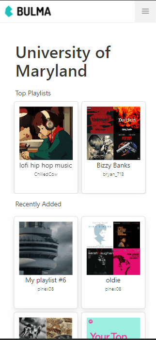

# Kickback 

Description about kickback 


## Table of Contents 
* [Dependencies](#dependencies)
* [Features](#features)

## Dependencies


## Features 
Able to share, stream and add music you discover. 


<details>

<summary> Select Your School </summary> 
<p align="center">
 
</p>

1.First we load the data at build time by using getStaticProps from Nextjs. This allows us to get the list of schools 
and pass them to the component as a prop. 


```javascript
// pages/index.js 

export async function getStaticProps(context) {

//Make a database request to get all the schools 
const school = await schools()
const colleges = school.schools


if (colleges != null){

    return {
    props: {colleges,...}, // will be passed to the page component as props
    }

}else{

    const colleges =  { name: 'Error Loading Schools' };
    return{
    props:{colleges}
    }
}
}


```


2.  Pass the list of schools as a prop to our home component and passing our list of schools to 
our Navbar component. 

```javascript 
function Home({colleges, ...}) {
return (
    <>
    <Head>
        ...
        <title>Kickback</title>
        ...
    </Head>


    <body>
        <Navbar listOfSchools={colleges}/>
        ...
    </body>
    </>
)
}


```


3. We use the imported school function to make a query to the database and select all 
schools. 

```javascript 

// lib/db/prisma

export async function schools() {


    //Make a database request to get all the schools 
    const getSchool = await prisma.$queryRaw`SELECT * FROM kickback.schools;`
    .catch(e => {
        throw e
    })
    .finally(async () => {
        await prisma.$disconnect()
    })        

    
    return {
        schools:getSchool
    }


}

```


4. Using Material UI to display an autocomplete box by passing in the list of school props to the options parameter. 

```javascript 
    // components/navbar.js  


    <Autocomplete
    id="combo-box-demo"
    disableClearable
    options={listOfSchools}
    getOptionLabel={(option) => option.name}
    style={{ width: 300 }}
    renderInput={(params) => <TextField {...params} label="Search" variant="outlined" />}
    onChange={(event, value) => setSchoolChoice(value.name)}
    />
    
    <div className="block" style={{marginTop:"4em"}}>
        <p className=""> Enter your school email </p>
        <input required className="input is-info block" type="email" placeholder="ex firstlast@name.uni.edu" onChange={event => setSchoolEmail(event.target.value)}></input>
    </div>


```


</details>


<details>

<summary> Login </summary> 


<p align="center">
 
</p>


1. For user login we use NextAuth which is a open source 


```javascript
// pages/api/auth/[...nextauth].js

// For more information on each option (and a full list of options) go to
// https://next-auth.js.org/configuration/options
const options = {
  // https://next-auth.js.org/configuration/providers
  providers: [
    Providers.Spotify({
        clientId: process.env.SPOTIFY_CLIENT_ID,
        clientSecret: process.env.SPOTIFY_CLIENT_SECRET,
        scope: 'scopes',
        accessTokenUrl: 'https://accounts.spotify.com/api/token',
        profile(profile) {
          return {
            id: profile.id,
            name: profile.display_name,
            email: profile.email,
            image: profile.images?.[0]?.url,
            uri: profile.uri,
            link: profile.href,
            country: profile.country,
            
          }
        },

    })
  ],

  adapter: Adapters.Prisma.Adapter({ prisma }),


  callbacks: {
    signIn: async (user, account, profile) => {
      return Promise.resolve(true)
    },
    redirect: async (url, baseUrl) => {
      return Promise.resolve(baseUrl)
    },
    session: async (session, user) => {
        ....
      return Promise.resolve(session)
    },
    jwt: async (token, user, account, profile, isNewUser) => {
      return Promise.resolve(token)
    }
  }


}


```


2.  Pass the list of schools as a prop to our home component and passing our list of schools to 
our Navbar component. 

```javascript 

{/* If the user is not Logged in  */}
{!session && 

    <button className="button is-primary" onClick={() => {isHidden(!isShown);}}>
        <strong>Connect</strong>
    </button>

}


{/* If the user is logged in */}
{session &&

    <>	

    
    {/* If the user school email is not verified then show the add school button */}
    {!isVerified && 

        <button className="button is-primary" onClick={() => {isHidingSchool(!isShowingSchool);}}>
        <strong>Add School</strong>
        </button>

    
    }
    


    {/* If the user school email is verified then show a custom button with a href link to their school page */}

    {isVerified && 
        <>
            <Link href='http://localhost:3000/schools/University-of-Maryland'>
                <button className="button is-light">
                    <span className="icon">
                        <i className="fas fa-graduation-cap"></i>
                    </span>
                    <span>{session.user.school}</span>
                </button>
            </Link>
            
            <button className="button is-success" onClick={() => {setPlaylists(!isShowingPlaylists);}}>
                <p>Add a Playlist</p>
            </button>
        </>
    }


    <button className="button is-warning" onClick={signOut}>
        <strong>Sign Out</strong>
    </button>
</>
}

```


3. Connect Modal Popup 

- Create a react state to trigger when to show the pop up 
``` javascript 
//components/navbar 

//Show modal card to connect to provider 
const [isShown, isHidden] = React.useState(false);

```

Display the pop up to send you to the spotify login from nextAuth 
```javascript 

// components/navbar 
<div className={`modal ${isShown ? "is-active" : ""}`}>
    <div className="modal-background"></div>
    <div className="modal-content">
        <div className="box is-primary has-text-centered">

            <div className="is-right small_height">
                <button className="button is-white exit_icon" onClick={() => {isHidden(!isShown);}}>
                    <span className="icon is-small">
                        <i className="fas fa-times"></i>
                    </span>
                </button>
            </div>
            
            <div className="block">
                <p className="title">Connect Account</p>
                <p className="subtitle">To follow, add and sync playlist you must connect with your music provider</p>
            </div> 


            <div className="block">		
                <button className="button is-success is-rounded" onClick={e => { e.preventDefault(); signIn('spotify') }}>
                    <span className="icon">
                        <i className="fab fa-spotify"></i>
                    </span>
                    <span>
                        Spotify
                    </span>
                </button>										
            </div>							                                          
        </div>
    </div>		
</div>


```


</details>


<details>

<summary> Add/Remove Playlist </summary> 


<p align="center">
 
</p>


1. For user login we use NextAuth which is a open source 


```javascript
// pages/api/auth/[...nextauth].js

// For more information on each option (and a full list of options) go to
// https://next-auth.js.org/configuration/options
const options = {
  // https://next-auth.js.org/configuration/providers
  providers: [
    Providers.Spotify({
        clientId: process.env.SPOTIFY_CLIENT_ID,
        clientSecret: process.env.SPOTIFY_CLIENT_SECRET,
        scope: 'scopes',
        accessTokenUrl: 'https://accounts.spotify.com/api/token',
        profile(profile) {
          return {
            id: profile.id,
            name: profile.display_name,
            email: profile.email,
            image: profile.images?.[0]?.url,
            uri: profile.uri,
            link: profile.href,
            country: profile.country,
            
          }
        },

    })
  ],

  adapter: Adapters.Prisma.Adapter({ prisma }),


  callbacks: {
    signIn: async (user, account, profile) => {
      return Promise.resolve(true)
    },
    redirect: async (url, baseUrl) => {
      return Promise.resolve(baseUrl)
    },
    session: async (session, user) => {
        ....
      return Promise.resolve(session)
    },
    jwt: async (token, user, account, profile, isNewUser) => {
      return Promise.resolve(token)
    }
  }


}


```


2.  Pass the list of schools as a prop to our home component and passing our list of schools to 
our Navbar component. 

```javascript 

{/* If the user is not Logged in  */}
{!session && 

    <button className="button is-primary" onClick={() => {isHidden(!isShown);}}>
        <strong>Connect</strong>
    </button>

}


{/* If the user is logged in */}
{session &&

    <>	

    
    {/* If the user school email is not verified then show the add school button */}
    {!isVerified && 

        <button className="button is-primary" onClick={() => {isHidingSchool(!isShowingSchool);}}>
        <strong>Add School</strong>
        </button>

    
    }
    


    {/* If the user school email is verified then show a custom button with a href link to their school page */}

    {isVerified && 
        <>
            <Link href='http://localhost:3000/schools/University-of-Maryland'>
                <button className="button is-light">
                    <span className="icon">
                        <i className="fas fa-graduation-cap"></i>
                    </span>
                    <span>{session.user.school}</span>
                </button>
            </Link>
            
            <button className="button is-success" onClick={() => {setPlaylists(!isShowingPlaylists);}}>
                <p>Add a Playlist</p>
            </button>
        </>
    }


    <button className="button is-warning" onClick={signOut}>
        <strong>Sign Out</strong>
    </button>
</>
}

```


3. Connect Modal Popup 

- Create a react state to trigger when to show the pop up 
``` javascript 
//components/navbar 

//Show modal card to connect to provider 
const [isShown, isHidden] = React.useState(false);

```

Display the pop up to send you to the spotify login from nextAuth 
```javascript 

// components/navbar 
<div className={`modal ${isShown ? "is-active" : ""}`}>
    <div className="modal-background"></div>
    <div className="modal-content">
        <div className="box is-primary has-text-centered">

            <div className="is-right small_height">
                <button className="button is-white exit_icon" onClick={() => {isHidden(!isShown);}}>
                    <span className="icon is-small">
                        <i className="fas fa-times"></i>
                    </span>
                </button>
            </div>
            
            <div className="block">
                <p className="title">Connect Account</p>
                <p className="subtitle">To follow, add and sync playlist you must connect with your music provider</p>
            </div> 


            <div className="block">		
                <button className="button is-success is-rounded" onClick={e => { e.preventDefault(); signIn('spotify') }}>
                    <span className="icon">
                        <i className="fab fa-spotify"></i>
                    </span>
                    <span>
                        Spotify
                    </span>
                </button>										
            </div>							                                          
        </div>
    </div>		
</div>


```


</details>

